# 🍽️ NiyasKitchenInventory  

**NiyasKitchenInventory** is a custom-built **iOS app** for managing restaurant inventory, suppliers, and purchase orders. It’s designed for **single-restaurant teams** who need lightweight but powerful stock tracking — and doubles as a **portfolio project** showcasing modern iOS development practices.  

---

## 🚀 Features  

- **Authentication** – Firebase Email/Password login & user roles (Admin / Staff)  
- **Dashboard** – Quick KPIs (low stock, waste tracking, weekly stats)  
- **Inventory Management** – Add/edit/delete items, units, categories, suppliers  
- **Stock Movements** – Track IN / OUT / Waste, with automatic quantity updates  
- **Purchase Orders (PO)** – Create, send, and manage supplier orders with line items  
- **Punch In/Out (Attendance)** – Log staff shifts, view weekly/monthly total hours  
- **Daily Sales Reports ** – Staff can enter daily collection totals (Card, Cash, Uber Eats, etc.)
- **Table Bookings ** – Add/view reservations, highlight today’s bookings with sections by date
- **Firestore Integration** – Real-time sync of all data across devices  
- **Role-based Access** – Admin creates users & manages permissions  

---

## 🛠️ Tech Stack  

- **Language:** Swift 6  
- **UI Framework:** SwiftUI  
- **Architecture:** MVVM with `@Observable`, Swift Concurrency (`async/await`)  
- **Backend:** Firebase (Auth, Firestore, Storage)  
- **CI/CD:** GitHub Actions (build workflows, unit tests planned)  
- **Tools:**  
  - P4Merge (merge conflict resolution)  
  - Xcode 16.1 (iOS 17.4 minimum deployment target)  

---
## 🧪 Testing & CI/CD  

- **Unit Tests:** Planned using XCTest for services & ViewModels  
- **CI/CD:** GitHub Actions workflow configured  
  - Runs `xcodebuild clean build` on pull requests  
  - Detects breaking changes early  
  - Next step: integrate unit tests into CI  

---
## 📸 Screenshots & Diagrams

  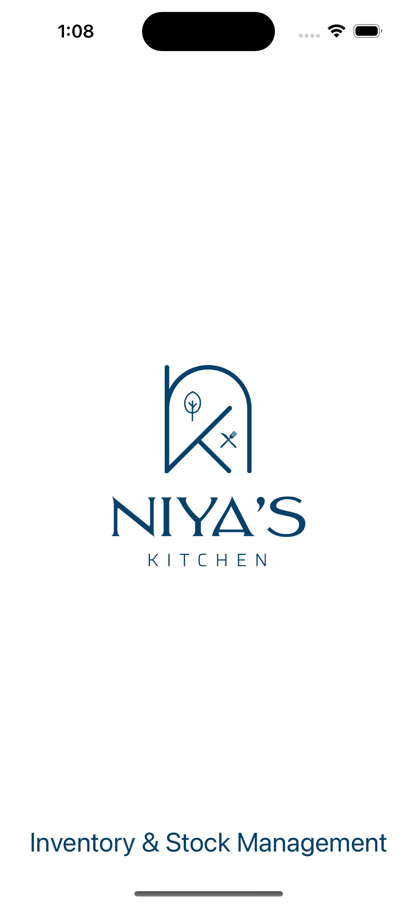
  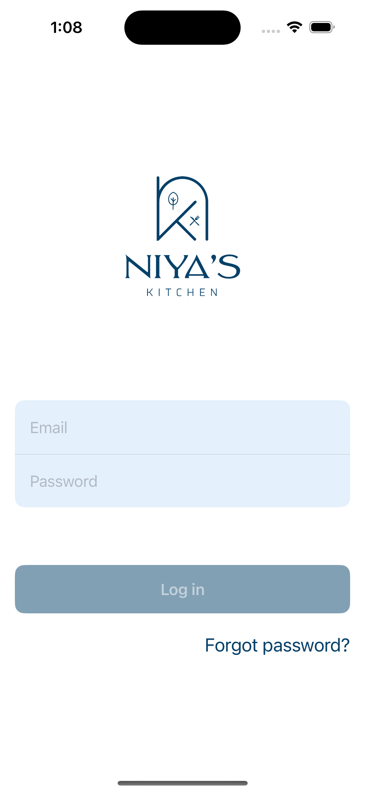
  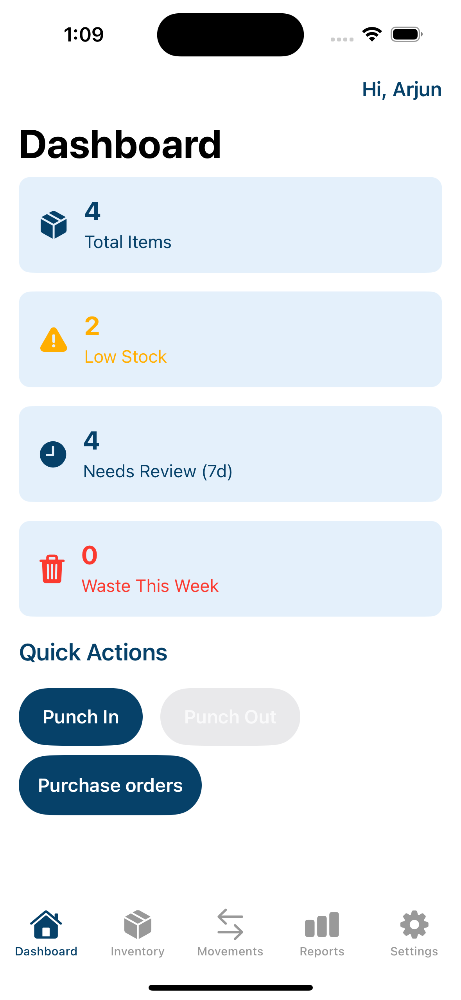
  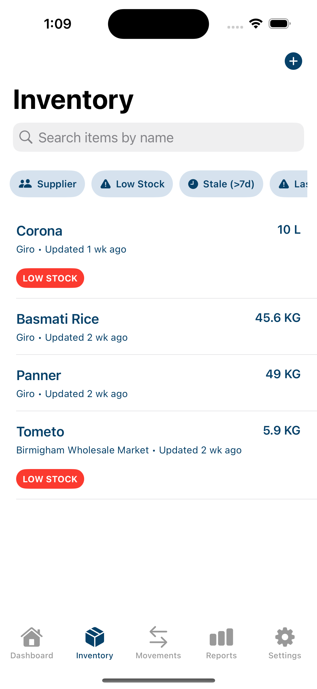
  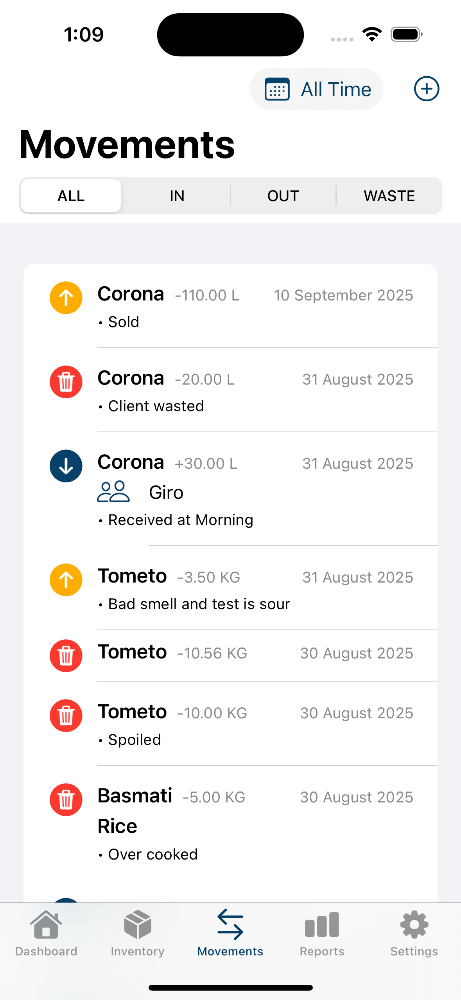
  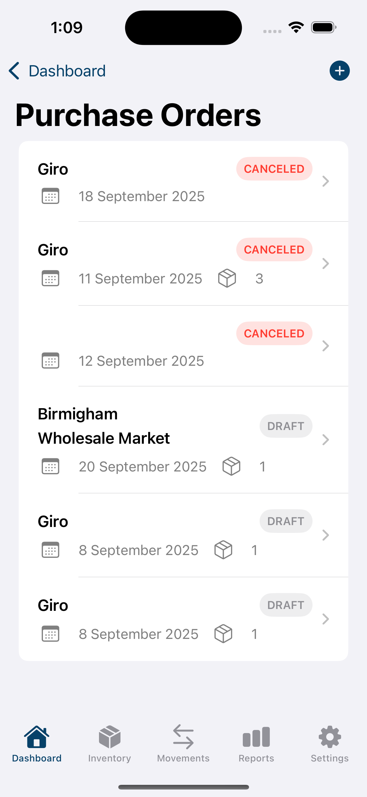
  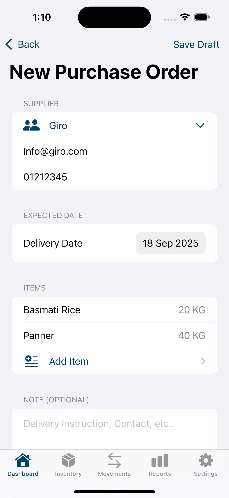
  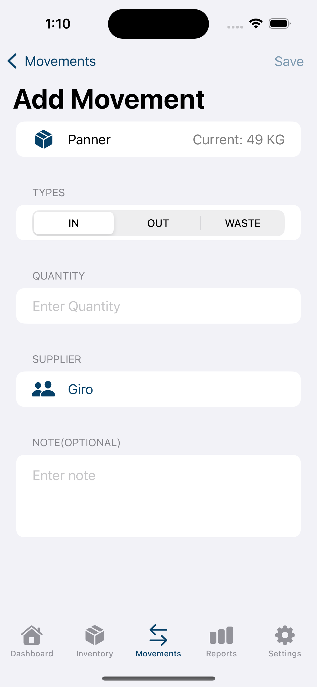
  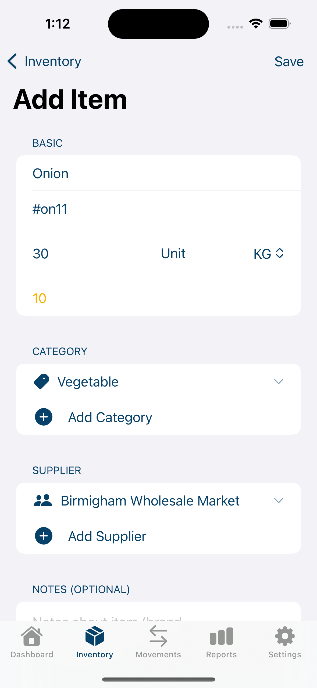
  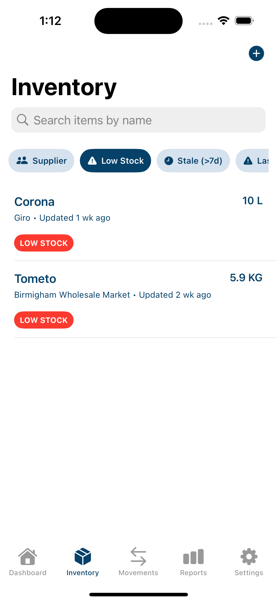
  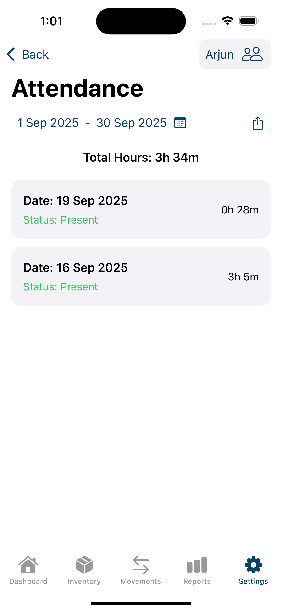
  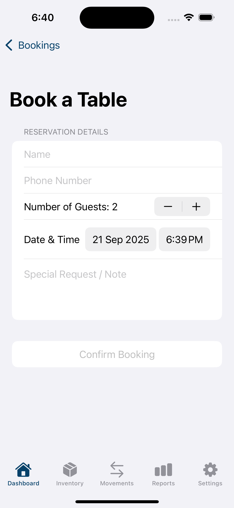
  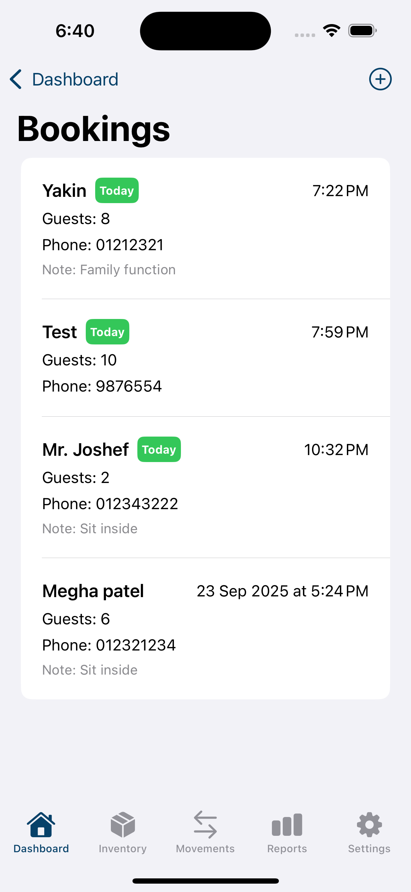
  

## 💡 What I Learned  

- Implementing **Swift Concurrency** safely with `Sendable` & actor isolation  
- Handling **Firestore schema design** (inventory, suppliers, POs, movements)  
- Setting up **CI/CD with GitHub Actions** for iOS projects  
- Managing **merge conflicts** with P4Merge and Xcode merge editor  
- Building a full app workflow from login → dashboard → inventory → orders  

---

## 🧑‍💻 Author  

Developed by **Arjun Patel**  
👨‍🍳 Founder of **Niya’s Kitchen**, passionate about **Swift development & restaurant tech**  

---

⚡ *This project is both a production tool for my restaurant and a showcase of my iOS engineering skills for potential employers.* 

